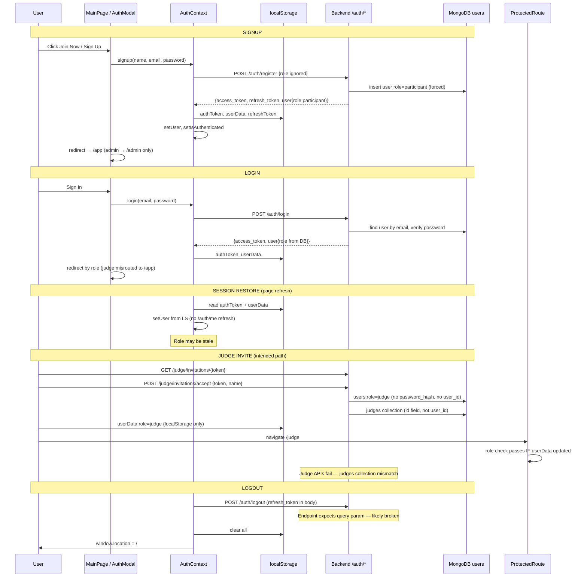

# HackaVerse — Current Project Status

**Audit type:** System Discovery + Integration + Production Readiness  
**Date:** 2026-05-31  
**Scope:** Why only the Participant platform is visible after deployment  
**Action taken:** Discovery and trace only — **no fixes implemented**

---

## Executive Summary

Admin and Judge **UI and API code exist**, but they are **not visible in production** because:

1. **Every self-registered user is forced to `participant`** — there is no signup path to admin or judge.
2. **Production databases are unlikely to contain admin/judge users** unless `seed_data.py` was run manually against the production MongoDB.
3. **Navigation and post-login redirects are participant-centric** — the landing page, account menu, and default redirect all send users to `/app`.
4. **Judge onboarding is incomplete/broken** — invitation acceptance does not create login credentials, and judge API authorization checks a `judges` collection that is never seeded and uses the wrong field names.
5. **Several admin/judge pages and API mappings are disconnected or broken**, so even role-correct users would hit partial failures.

**Root cause (one sentence):** The deployed app works as designed for public participant self-registration; admin and judge are gated behind roles that are never assigned in production and have incomplete integration paths.

---

## Phase 1 — Role System Discovery

### Implemented roles

| Role | Value | Frontend guard | Backend storage |
|------|-------|----------------|-----------------|
| Participant | `participant` | `ProtectedRoute requiredRole="participant"` | `users.role` |
| Admin | `admin` | `ProtectedRoute requiredRole="admin"` | `users.role` |
| Judge | `judge` | `ProtectedRoute requiredRole="judge"` | `users.role` + separate `judges` collection |

**Evidence:**
- `hackaverse-frontend/src/utils/rbac.js` — `ROLES.ADMIN`, `ROLES.JUDGE`, `ROLES.PARTICIPANT`
- `hackathon/src/db_models.py` — `role: str  # admin, participant, judge`

### Where roles are stored

| Location | Field | Notes |
|----------|-------|-------|
| MongoDB `users` collection | `role` | Canonical role for login response |
| Frontend `localStorage` | `userData` JSON | `{ ..., role: "participant" \| "admin" \| "judge" }` |
| JWT access token | **Not included** | Payload: `user_id`, `email`, `iat`, `exp` only |
| MongoDB `judges` collection | separate docs | Used by judge review APIs — **not in `COLLECTIONS` dict** |
| API key (middleware) | `API_KEY_ROLES` map | Maps `API_KEY` env → `"admin"` — **not user role** |

### Role creation logic

| Path | Can create admin? | Can create judge? | Can create participant? |
|------|-------------------|-------------------|-------------------------|
| `POST /auth/register` | **No** — forced `participant` | **No** — forced `participant` | **Yes** |
| `POST /judge/invitations/accept` | No | Partial — sets `users.role=judge` but **no password** | No |
| `python hackathon/seed_data.py` | **Yes** — `admin@hackaverse.com` | **Yes** — `judge@hackaverse.com` | **Yes** |
| Admin UI "Invite Judge" | No (creates invitation only) | Partial | No |
| Any admin API to promote user | **Does not exist** | **Does not exist** | N/A |

**Registration override (critical):**

```python
# hackathon/src/routes/auth_routes.py (lines 181, 35-37)
"role": "participant",  # SECURITY: Always force participant on registration
# Comment: Admin/judge roles can ONLY be assigned by an existing admin.
# Reality: No such admin assignment endpoint exists.
```

### Signup logic (frontend)

- `AuthModal.jsx` → `signup(name, email, password)` — **no role parameter exposed**
- `AuthContext.signup()` defaults `role = 'participant'` but backend ignores it anyway

### Login logic

- `AuthContext.login()` → `POST /auth/login` → stores `user.role` from response in `localStorage`
- **No call to `GET /auth/me` on app init** — role is never refreshed from DB after login
- Session restore reads stale `userData` from `localStorage` only

### JWT handling

- Created in `auth_routes.create_jwt_token()` — **no role claim**
- Verified in `auth.py get_current_user_id()` — extracts `user_id` only
- Frontend stores token as `authToken` in `localStorage`

### Permission checks

| Layer | Mechanism | Enforces user role? |
|-------|-----------|---------------------|
| Frontend routes | `ProtectedRoute` compares `user.role === requiredRole` | **Yes** |
| Frontend RBAC | `rbac.js` permission matrix | UI-only, rarely used |
| Backend middleware | `SecurityMiddleware` + `get_api_key_role()` | **API key role only**, not JWT user role |
| Backend route deps | `get_api_key` on most routes | Shared key from frontend env |
| Judge review routes | `judges` collection lookup by `user_id` | **Yes**, but broken (see Phase 5) |

### Answer: Can users actually become admin / judge / participant?

| Role | In production today? | How |
|------|----------------------|-----|
| **Participant** | **Yes** — default for all signups | Register or login |
| **Admin** | **Only if manually seeded** | `seed_data.py` → `admin@hackaverse.com` / `admin@123` |
| **Judge** | **Only if manually seeded OR broken invite flow** | Seed account OR accept invitation (incomplete) |

**Conclusion:** In a typical deployed environment where users self-register, **all users are participants**. Admin and judge platforms exist in code but are unreachable without manual DB seeding or direct URL access with a pre-seeded account.

---

## Phase 2 — Frontend Role Audit

### Route tree (`App.jsx`)

```
/                              Public — MainPage (landing + auth modal)
/leaderboard                   Public — PublicLeaderboard
/invite/accept                 Public — team invitation
/judge/accept                  Public — judge invitation (token in query)

/admin                         Admin — AdminHome           [requiredRole=admin]
/admin/participants            Admin — AdminParticipants [requiredRole=admin]
/admin/submissions             Admin — AdminSubmissions  [requiredRole=admin]
/admin/settings                Admin — AdminSettings     [requiredRole=admin]
/admin/register-team           Admin — TeamRegistration  [requiredRole=admin]
/admin/hackathons              Admin — HackathonManagement [requiredRole=admin]

/app                           Participant — ParticipantHome [requiredRole=participant]
/app/teams                     Participant — Teams
/app/submissions               Participant — Submissions
/app/profile                   Participant — ProfilePage
/app/profile/edit              Participant — EditProfilePage
/join-hackathon                Participant — JoinHackathon
/create-team/:hackathonId      Participant — CreateTeam

/judge                         Judge — JudgeHome           [requiredRole=judge]
/judge/queue                   Judge — JudgeQueue          [requiredRole=judge]
/judge/scores                  Judge — JudgeScores         [requiredRole=judge]
/judge/manual-review           Judge — ManualReview        [requiredRole=judge]

/hacka-agent                   Any authenticated user
```

### Components imported but NOT routed

| Component | Intended role | Status |
|-----------|---------------|--------|
| `LogsViewer.jsx` | Admin | **Unreachable** — no route |
| `RewardManagement.jsx` | Admin | **Unreachable** — no route |
| `Projects.jsx` | Shared | **Unreachable** — no route in App.jsx |
| `JudgeSubmit.jsx` | Judge | **Unreachable** — no route |

### Links to non-existent routes

| Source | Target | Status |
|--------|--------|--------|
| `AdminHome.jsx` | `/admin/projects` | **Broken** — no route |
| `AuthenticatedLayout` (judge sidebar) | `/logs` | **Broken** — no route |
| `AccountMenu.jsx` | `/app/settings` | **Broken** — no route |
| `NotificationDropdown.jsx` | `/logs` | **Broken** — no route |

### Route accessibility matrix

| Route prefix | Code exists | SPA rewrite OK | Role gate | Visible in nav | Production accessible |
|--------------|-------------|----------------|-----------|----------------|----------------------|
| `/app/*` | Yes | Yes (vercel.json) | participant | Yes (default sidebar) | **Yes** |
| `/admin/*` | Yes | Yes | admin | Only if `user.role=admin` | **No** (no admin users) |
| `/judge/*` | Yes | Yes | judge | Only if `user.role=judge` | **No** (no judge users) |
| `/judge/accept` | Yes | Yes | Public | Email link only | Partial (broken backend) |

### Post-login redirect (`MainPage.jsx`)

```javascript
const redirectPath = user.role === 'admin' ? '/admin' : '/app';
// Judge users → /app (wrong initial target; ProtectedRoute redirects to /judge)
```

---

## Phase 3 — Protected Route Audit

### Components traced

| Component | Exists? | Purpose |
|-----------|---------|---------|
| `ProtectedRoute.jsx` | Yes | Auth + role gate |
| `AuthContext.jsx` | Yes | Session state, login/signup/logout |
| `RoleContext` | **No** | Not implemented — role lives inside AuthContext `user` object |
| JWT decoding (frontend) | **No** | Role not in JWT; read from stored user object |

### ProtectedRoute behavior

```
1. isLoading → spinner
2. !isAuthenticated → redirect to / (with redirectTo in state)
3. requiredRole && user.role !== requiredRole → redirect to role home:
     admin → /admin
     judge → /judge
     default → /app
4. else → render children
```

### Can Admin routes be reached?

| Condition | Result |
|-----------|--------|
| Unauthenticated user navigates to `/admin` | Redirected to `/` |
| Participant navigates to `/admin` | Redirected to `/app` |
| User with `user.role=admin` in localStorage | **Routes render** — admin sidebar shown |
| Production self-registered user | **Never** — role is always `participant` |

### Can Judge routes be reached?

| Condition | Result |
|-----------|--------|
| Unauthenticated user | Redirected to `/` |
| Participant navigates to `/judge` | Redirected to `/app` |
| User with `user.role=judge` | **Routes render** — judge sidebar shown |
| After judge invitation accept | localStorage updated to `judge` but **AuthContext state not updated** until page reload |
| Production self-registered user | **Never** |

### Why Admin/Judge routes fail in production

**Primary:** `user.role === 'participant'` for all self-registered users.  
**Secondary:** Even with correct role, API calls behind those pages may fail (see Phase 5–6).

---

## Phase 4 — Auth Flow Trace



### Role assignment summary

| Event | Role assigned | Persisted where |
|-------|---------------|-----------------|
| Register | `participant` (forced) | DB + localStorage |
| Login | From DB | localStorage |
| Judge invite accept | `judge` | DB users (partial) + localStorage |
| Admin creation | **No automated path** | seed script only |

---

## Phase 5 — Backend Route Audit

### Admin APIs

| Endpoint | Exists | Protected | Used by frontend | Status |
|----------|--------|-----------|------------------|--------|
| `GET /admin/dashboard` | Yes | API key | AdminHome, SyncContext | **Connected** |
| `POST /admin/reward` | Yes | API key | RewardManagement (unrouted) | Unused in UI |
| `POST /judge/invitations/send` | Yes | API key | InviteJudgeModal | **Connected** |
| `POST /admin/invite-participant` | **No** | — | InviteParticipantModal | **Missing** |
| `POST /registration` | **No** | — | TeamRegistration | **Missing** |
| `GET /projects` | **No** | — | apiService.admin.getProjects | **Missing** |
| `GET /system/logs` | **No** | — | LogsViewer (unrouted) | **Missing** |
| `GET /reward` | Yes | API key | RewardManagement | Partial |
| `GET /hackathons` | Yes | API key (writes) | HackathonManagement | **Connected** |
| `POST/PATCH/DELETE /hackathons/*` | Yes | API key | HackathonManagement | **Connected** |

### Judge APIs

| Endpoint | Exists | Protected | Used by frontend | Status |
|----------|--------|-----------|------------------|--------|
| `GET /judge/submissions` | Yes | API key + JWT + judges lookup | JudgeHome | **Broken** — judges collection / KeyError |
| `GET /judge/submissions/pending` | Yes | API key + JWT + judges lookup | ManualReview | **Broken** |
| `POST /judge/review/submit` | Yes | API key + JWT + judges lookup | ManualReview | **Broken** |
| `GET /judge/rank` | Yes | API key | JudgeQueue, AdminSubmissions | **Partial** — wrong HTTP method in AdminSubmissions (POST) |
| `GET /judge/queue` | Yes | API key | Not used | Unused |
| `GET /judge/scores` | Yes | API key | Not used | Unused — frontend uses mock data |
| `POST /judge/score`, `/submit`, `/batch` | Yes | API key | apiService.judge | Available, limited UI |
| `GET /judge/invitations/{token}` | Yes | Public | AcceptJudgeInvitation | **Partial** — wrong base URL env var |
| `POST /judge/invitations/accept` | Yes | Public | AcceptJudgeInvitation | **Broken** — incomplete user record |
| `GET /judge/list` | Yes | API key | Not used | Unused |

### Participant APIs (shared routes)

| Endpoint | Exists | Used by frontend | Status |
|----------|--------|------------------|--------|
| `POST /auth/register`, `/login` | Yes | AuthModal | **Working** |
| `GET /hackathons`, `/hackathons/active` | Yes | Participant flows | **Working** |
| `GET/POST /teams/*` | Yes | Teams, CreateTeam | **Working** |
| `GET/POST /submissions/*` | Yes | Submissions | **Working** |
| `GET/PATCH /user/profile` | Yes | Profile pages | **Working** |
| `GET /leaderboard/{id}` | Yes | Leaderboard | **Working** |

### Critical backend defects affecting judge/admin

1. **`COLLECTIONS["judges"]` KeyError** — `judges` not defined in `db_models.COLLECTIONS`; all `judge_review.py` endpoints will 500.
2. **Judge record uses `id` not `user_id`** — `judge_invitations.py` creates `{ id: uuid }`; `judge_review.py` queries `{ user_id: ... }`.
3. **Seed script creates judge in `users` only** — no `judges` collection entry → judge APIs return 403 even for seeded judge.
4. **Judge invite creates user without `password_hash` or `user_id`** — invited judge cannot log in normally.
5. **No admin role promotion API** — comment in auth says admin assigns roles; no endpoint implements this.

---

## Phase 6 — Frontend ↔ Backend Mapping

### Admin pages

| Page | API call(s) | Backend route | Status |
|------|-------------|---------------|--------|
| **AdminHome** | `apiService.admin.getDashboard()` | `GET /admin/dashboard` | ✅ Connected |
| **AdminHome** | `apiService.announcements.create()` | `POST /notifications/announcements` | ✅ Connected |
| **AdminParticipants** | SyncContext (teams-derived) | `GET /teams`, `/hackathons` | ⚠️ No direct users API; hardcodes `role: participant` |
| **AdminSubmissions** | `fetch POST /judge/rank` | `GET /judge/rank` | ❌ Wrong HTTP method |
| **AdminSettings** | None (mock data) | — | ❌ Disconnected |
| **HackathonManagement** | `GET/POST/PATCH/DELETE /hackathons` | hackathons routes | ✅ Connected |
| **TeamRegistration** | `apiService.admin.registerTeam()` | `POST /registration` | ❌ Endpoint missing |
| **InviteJudgeModal** | `apiService.admin.inviteJudge()` | `POST /judge/invitations/send` | ✅ Connected |
| **InviteParticipantModal** | `apiService.admin.inviteParticipant()` | `POST /admin/invite-participant` | ❌ Endpoint missing |
| **LogsViewer** (unrouted) | `apiService.admin.getLogs()` | `GET /system/logs` | ❌ Endpoint missing |
| **RewardManagement** (unrouted) | `apiService.admin.applyReward()` | `POST /reward` | ⚠️ Route exists at `/reward` not `/admin/reward` |

### Judge pages

| Page | API call(s) | Backend route | Status |
|------|-------------|---------------|--------|
| **JudgeHome** | `GET /judge/submissions?status=submitted` | judge_review | ❌ Token key wrong (`token` vs `authToken`); judges lookup broken |
| **JudgeQueue** | `apiService.judge.getRankings()` | `GET /judge/rank` | ⚠️ Shows rankings not pending queue |
| **JudgeScores** | None | — | ❌ Hardcoded mock data |
| **ManualReview** | `GET /judge/submissions/pending` | judge_review | ❌ Judges collection broken |
| **ManualReview** | `POST /judge/review/submit` | judge_review | ❌ Judges collection broken |
| **AcceptJudgeInvitation** | Direct axios to `VITE_API_BASE_URL` | `/judge/invitations/*` | ⚠️ Bypasses `/api/v1` prefix (works via unversioned aliases); env var mismatch risk |

---

## Phase 7 — Deployment Blocker Analysis

### Why Admin/Judge are not visible (evidence-ranked)

| # | Cause | Evidence | Severity |
|---|-------|----------|----------|
| 1 | **All signups forced to participant** | `auth_routes.py:181` | **P0** |
| 2 | **Production DB not seeded with admin/judge** | No seed in deploy pipeline; `render.yaml` has no seed step | **P0** |
| 3 | **Role-gated sidebar hides admin/judge nav** | `AuthenticatedLayout.jsx` — `getSidebarItems()` by `user.role` | **P0** |
| 4 | **Landing page redirects to `/app` for non-admin** | `MainPage.jsx:23,37` — judges included | **P1** |
| 5 | **No public link to admin/judge portals** | MainPage nav: Tracks, Leaderboard, Projects, About only | **P1** |
| 6 | **Judge invite flow incomplete** | No password, no `user_id`, judges collection mismatch | **P0** |
| 7 | **Judge review APIs broken** | `COLLECTIONS["judges"]` KeyError | **P0** |
| 8 | **AuthContext never refreshes role from server** | No `/auth/me` on init | **P1** |
| 9 | **AcceptJudgeInvitation uses wrong env var** | `VITE_API_BASE_URL` vs canonical `VITE_API_URL` | **P1** |
| 10 | **Unrouted admin/judge components** | LogsViewer, RewardManagement not in App.jsx | **P2** |
| 11 | **Broken API mappings** | invite-participant, registration, system/logs missing | **P1** |
| 12 | **AccountMenu hardcoded to participant paths** | Always `/app/profile` | **P2** |

### Deployment configuration (not blockers for visibility)

| Check | Status | Notes |
|-------|--------|-------|
| Vercel SPA rewrites | ✅ OK | `vercel.json` → all routes → `index.html` |
| React Router admin/judge routes | ✅ Defined | Routes exist; role gate blocks access |
| `VITE_API_URL` | Required | Documented in DEPLOYMENT_NOTES.md |
| `VITE_API_KEY` must match backend | Required | Shared key sent for all users |
| CORS | Configured | `ALLOWED_ORIGINS` in render.yaml |
| vercel.json destination | ⚠️ Minor | Uses `/` vs `/index.html` — both work on Vercel |

**Deployment config is NOT the primary blocker.** The SPA correctly serves `/admin` and `/judge` if a user with the correct role accesses them. The blocker is **role assignment + integration gaps**.

---

## Phase 8 — Production Readiness Audit

| Area | Score | Notes |
|------|-------|-------|
| **Frontend — Participant** | 7/10 | Core flows work; some dead links |
| **Frontend — Admin** | 4/10 | UI exists; mock data, missing routes, broken API calls |
| **Frontend — Judge** | 3/10 | UI exists; mock data, wrong endpoints, token key bugs |
| **Backend — Core API** | 7/10 | Auth, teams, submissions, hackathons functional |
| **Backend — Admin API** | 5/10 | Dashboard works; several frontend-expected endpoints missing |
| **Backend — Judge API** | 3/10 | AI judge works; manual review path broken |
| **Authentication** | 6/10 | JWT login works; no role in token; logout param bug |
| **Authorization** | 3/10 | Frontend role gate only; backend uses shared API key for all users |
| **Database** | 6/10 | MongoDB connected in prod; schema inconsistencies (`judges`, `user_id`) |
| **Security** | 4/10 | Shared API key in frontend; default JWT secret warning; no user-level backend RBAC |
| **Logging / observability** | 6/10 | Trace IDs, structured logs; no APM |
| **Error handling** | 6/10 | APIResponse envelope; frontend interceptors |
| **Environment config** | 7/10 | `.env.example` documented; dual env var names cause confusion |
| **Deployment config** | 7/10 | Render + Vercel documented; no DB seed in pipeline |
| **Rate limiting** | 6/10 | Auth rate limit; invitation limiter |
| **Monitoring** | 4/10 | Health endpoints only; no alerting |

**Overall production readiness: 5.2 / 10** — Participant path is deployable; full multi-role platform is not.

---

## Final Report

### 1. What already works?

- Participant registration, login, session persistence
- Participant routes (`/app/*`), sidebar, team/submission/hackathon flows
- Public landing page and leaderboard
- Admin dashboard API (`GET /admin/dashboard`) when accessed with admin role + API key
- Hackathon CRUD from admin UI
- Judge invitation send (from admin UI, requires admin session)
- Backend health checks, CORS, SPA routing on Vercel
- AI judging endpoints (`/judge/score`, `/judge/submit`, `/judge/rank`)

### 2. What partially works?

- Judge UI renders if `user.role=judge` but APIs fail or return wrong data
- Judge invitation accept updates role in localStorage but not AuthContext; no login credentials
- Admin participants page (derived from teams, not users collection)
- Admin submissions page (wrong HTTP method to rank endpoint)
- SyncContext fetches admin dashboard for all authenticated users (not role-filtered)
- Token refresh interceptor (logout endpoint signature mismatch)

### 3. What is disconnected?

- `LogsViewer`, `RewardManagement`, `Projects`, `JudgeSubmit` — built but not routed
- `AdminSettings` judges/announcements — hardcoded mock data, no API
- `JudgeScores` — hardcoded mock data
- `apiService.admin.inviteParticipant`, `registerTeam`, `getProjects`, `getParticipants` — frontend calls with no backend
- `AccountMenu` — participant-only navigation for all roles
- Admin role promotion — documented intent, no implementation
- `seed_data.py` — not part of deployment pipeline

### 4. What is broken?

- `COLLECTIONS["judges"]` KeyError in `judge_review.py`
- Judge `user_id` vs `id` field mismatch between invitation and review flows
- Seeded judge cannot use judge review APIs (no `judges` collection record)
- `AdminSubmissions` uses POST instead of GET for `/judge/rank`
- `JudgeHome` reads `localStorage.getItem('token')` instead of `authToken`
- Judge invitation creates user without `password_hash` / `user_id`
- `POST /auth/logout` parameter binding (body vs query)
- Links to `/admin/projects`, `/logs`, `/app/settings` — 404 in SPA

### 5. Why are Admin/Judge not accessible?

**In production, every user is a participant.** Registration forces `role=participant`. The UI only shows admin/judge navigation when `user.role` matches, which requires either:

1. Running `seed_data.py` against production MongoDB and logging in as `admin@hackaverse.com` or `judge@hackaverse.com`, **or**
2. Manually updating a user's `role` field in MongoDB, **or**
3. Completing the judge invitation flow (currently broken for login and API access)

There is no in-app way for a deployed user to discover or access admin/judge portals.

### 6. What is required to connect all roles?

**Minimum viable (visibility + access):**

1. Seed or create admin/judge users in production MongoDB
2. Fix post-login redirect to send judges to `/judge`
3. Fix `COLLECTIONS` + judges collection schema (`user_id` consistency)
4. Complete judge invitation → account creation with password + login

**Full integration (functional platform):**

5. Implement admin endpoint to assign/promote roles (or document seed-only ops)
6. Fix all broken FE↔BE mappings (invite-participant, registration, logs, rank method)
7. Wire unrouted components or remove dead navigation links
8. Replace mock data in AdminSettings, JudgeScores with real API calls
9. Add `/auth/me` refresh on app init for role sync
10. Role-aware AccountMenu and navigation

### 7. What deployment risks exist?

| Risk | Impact |
|------|--------|
| No DB seed in CI/CD | Admin/judge accounts never created in prod |
| `VITE_API_KEY` exposed in frontend bundle | Anyone can call API-key-protected endpoints |
| `VITE_API_URL` vs `VITE_API_BASE_URL` split | Judge invite page may hit wrong URL |
| Render cold starts (30–60s) | Timeout on first request |
| Default JWT secret if env not set | Token forgery risk |
| MongoDB name mismatch (`BUCKET_DB_NAME` in render.yaml vs local) | Seed script targets wrong DB |

### 8. What production risks exist?

| Risk | Severity |
|------|----------|
| Backend authorization is API-key-based, not user-role-based | **Critical** |
| All frontend users share same API key | **Critical** |
| No audit trail for role changes | High |
| Judge/admin access depends on localStorage role (client-side) | High |
| Broken judge review path blocks manual scoring | High |
| Stale role in localStorage after DB changes | Medium |
| Mock data shown as real in admin/judge UI | Medium |

### 9. Execution plan (prioritized)

#### P0 — Critical (blocks multi-role platform)

| # | Task | Effort |
|---|------|--------|
| P0-1 | Run `seed_data.py` against **production** MongoDB OR manually insert admin/judge users with bcrypt passwords | 30 min |
| P0-2 | Add `judges` to `COLLECTIONS`; fix `judge_review.py` lookup (by email or user_id) | 1 hr |
| P0-3 | Fix judge invitation accept: set `user_id`, `password_hash`, sync `judges` collection | 2 hr |
| P0-4 | Seed `judges` collection entry for seeded judge user | 30 min |
| P0-5 | Fix `MainPage` redirect: `admin → /admin`, `judge → /judge`, else → /app | 15 min |
| P0-6 | Document production admin credentials securely (not in repo) | 15 min |

#### P1 — High (functional admin/judge after access)

| # | Task | Effort |
|---|------|--------|
| P1-1 | Fix `AcceptJudgeInvitation` to use `VITE_API_URL` + `/api/v1` | 30 min |
| P1-2 | Fix `JudgeHome` auth token key (`authToken` not `token`) | 15 min |
| P1-3 | Fix `AdminSubmissions` — GET not POST for `/judge/rank` | 15 min |
| P1-4 | Implement missing endpoints OR remove broken frontend calls (invite-participant, registration) | 4 hr |
| P1-5 | Add `GET /auth/me` on AuthContext init to sync role | 1 hr |
| P1-6 | Update `AcceptJudgeInvitation` to refresh AuthContext + require password setup | 2 hr |
| P1-7 | Role-aware `AccountMenu` navigation | 1 hr |

#### P2 — Medium (completeness)

| # | Task | Effort |
|---|------|--------|
| P2-1 | Route `LogsViewer`, `RewardManagement` in App.jsx or remove sidebar links | 1 hr |
| P2-2 | Replace mock data in `AdminSettings`, `JudgeScores` with API calls | 4 hr |
| P2-3 | Wire `JudgeQueue` to `GET /judge/submissions/pending` not `/judge/rank` | 1 hr |
| P2-4 | Fix logout endpoint parameter binding | 30 min |
| P2-5 | Add admin API to promote user role | 2 hr |

#### P3 — Low (polish / hardening)

| # | Task | Effort |
|---|------|--------|
| P3-1 | Include `role` in JWT claims; validate server-side | 4 hr |
| P3-2 | Remove shared API key from frontend; use user JWT for auth | 8 hr |
| P3-3 | Add seed step to deployment pipeline (optional, dev/staging only) | 2 hr |
| P3-4 | Remove console.log from ProtectedRoute (stripped in prod anyway) | 15 min |
| P3-5 | Unify `VITE_API_URL` / `VITE_API_BASE_URL` to single variable | 1 hr |

---

## Verification checklist (post-fix)

Use after implementing P0–P1 fixes:

- [ ] Login as `admin@hackaverse.com` → lands on `/admin`, admin sidebar visible
- [ ] Login as `judge@hackaverse.com` → lands on `/judge`, judge sidebar visible
- [ ] Login as self-registered user → lands on `/app`, participant sidebar only
- [ ] Direct navigate `/admin` as participant → redirected to `/app`
- [ ] Direct navigate `/judge` as participant → redirected to `/app`
- [ ] Admin → Invite Judge → email sent → accept link → judge can log in
- [ ] Judge → Manual Review → pending submissions load (no 403/500)
- [ ] Admin → Dashboard KPIs load from API
- [ ] Admin → Hackathons CRUD works
- [ ] No console 404s for `/admin/projects`, `/logs`, `/app/settings`

---

## Key file reference

| Purpose | Path |
|---------|------|
| Frontend routing | `hackaverse-frontend/src/App.jsx` |
| Role gate | `hackaverse-frontend/src/components/auth/ProtectedRoute.jsx` |
| Auth state | `hackaverse-frontend/src/contexts/AuthContext.jsx` |
| Role sidebar | `hackaverse-frontend/src/components/layout/AuthenticatedLayout.jsx` |
| Login redirect bug | `hackaverse-frontend/src/components/MainPage.jsx` |
| Registration role force | `hackathon/src/routes/auth_routes.py` |
| Judge review (broken) | `hackathon/src/routes/judge_review.py` |
| Judge invitation | `hackathon/src/routes/judge_invitations.py` |
| Seed script | `hackathon/seed_data.py` |
| API mappings | `hackaverse-frontend/src/services/api.js` |
| Deployment | `DEPLOYMENT_NOTES.md`, `hackaverse-frontend/vercel.json` |

---

*End of audit report. No code changes were made.*
