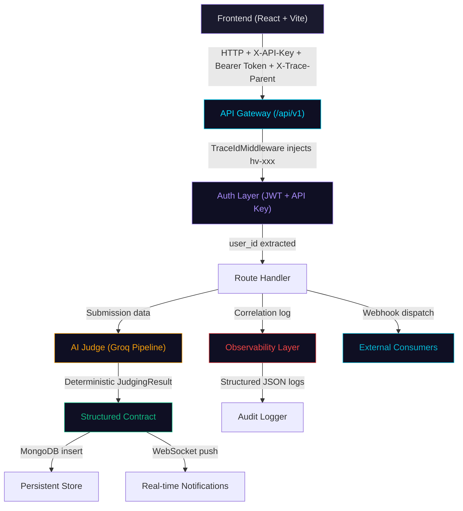

# HackaVerse — Ecosystem Interaction Flow

## Overview

HackaVerse is designed as a **deterministic, replay-safe participant** in the TANTRA governed execution ecosystem. This document maps every interaction boundary, trace continuity point, and contract surface.

---

## Execution Flow Diagram



---

## Trace Continuity Chain

Every request flows through the following trace-aware stages:

| Stage | Component | Trace Behavior |
|-------|-----------|----------------|
| 1 | **Frontend** | Sends `X-Trace-Parent` header with last known `trace_id` |
| 2 | **TraceIdMiddleware** | Generates `hv-<hex16>`, captures `X-Trace-Parent` as `parent_trace_id` |
| 3 | **SecurityMiddleware** | Validates API key, respects trace_id |
| 4 | **Auth Layer** | Extracts `user_id` from JWT, sets `request.state.user_id` |
| 5 | **Route Handler** | Uses `CorrelationLogger.from_request()` for structured logging |
| 6 | **APIResponse** | Includes `trace_id` in every response body |
| 7 | **Error Handler** | Preserves `trace_id` in error responses with `error_code` |
| 8 | **Frontend** | Captures `X-Request-Id` via interceptor, stores as `_lastTraceId` |

**Trace lineage is preserved across the entire chain:**
```
Request N: parent_trace_id = null,        trace_id = hv-abc123
Request N+1: parent_trace_id = hv-abc123, trace_id = hv-def456
Request N+2: parent_trace_id = hv-def456, trace_id = hv-ghi789
```

**No trace is ever mutated or dropped across the chain.**

---

## Structured Log Entry Format

Every log emitted by `CorrelationLogger` follows this schema:

```json
{
  "trace_id": "hv-abc123def456",
  "parent_trace_id": "hv-previous-trace",
  "event_type": "request_completed",
  "route": "/api/v1/auth/login",
  "method": "POST",
  "user_id": "usr_001",
  "status": 200,
  "elapsed_ms": 45.23,
  "timestamp": "2026-05-26T10:30:00Z",
  "details": {}
}
```

---

## Replay Safety

HackaVerse ensures replay safety through:

1. **Idempotent request IDs** — Submissions carry `request_id` checked by `replay_protection.py`
2. **Nonce validation** — `SecurityMiddleware` validates `X-Nonce` to prevent replay attacks
3. **Deterministic scoring** — AI judge produces identical scores for identical inputs
4. **Versioned judgments** — Each judgment carries a `version` field for lineage
5. **Hash-linked provenance** — `security.py` creates hash-linked ledger entries

---

## Contract Boundaries

### Upstream (Frontend → Backend)
```json
{
  "headers": {
    "Authorization": "Bearer <jwt>",
    "X-API-Key": "<api_key>",
    "X-Trace-Parent": "<previous_trace_id>",
    "Content-Type": "application/json"
  },
  "body": {
    "submission_text": "...",
    "team_id": "team_xxx",
    "request_id": "req_xxx"
  }
}
```

### Downstream (Backend → Frontend)
```json
{
  "success": true,
  "message": "Submission scored successfully",
  "data": {
    "submission_hash": "sub_xxx",
    "total_score": 85.5,
    "scores": {"clarity": 8.5, "innovation": 9.0, "quality": 8.0},
    "confidence": 0.92
  },
  "trace_id": "hv-abc123def456",
  "error_code": null
}
```

### Error Contract (any failure)
```json
{
  "success": false,
  "message": "Invalid email or password",
  "data": null,
  "trace_id": "hv-abc123def456",
  "error_code": "AUTH_INVALID_CREDENTIALS"
}
```

### Response Headers
```
X-Request-Id: hv-abc123def456
```

---

## Observability Boundaries

| Boundary | What is logged | Format |
|----------|---------------|--------|
| Request start | `trace_id`, `parent_trace_id`, `route`, `method`, `timestamp` | JSON structured log |
| Request complete | `trace_id`, `parent_trace_id`, `status`, `elapsed_ms` | JSON structured log |
| Request failure | `trace_id`, `parent_trace_id`, `error_code`, `status`, `message` | JSON structured log |
| Auth events | `user_id`, `trace_id`, login/register/refresh | Logger with prefix |
| Judge events | `submission_hash`, `total_score`, `trace_id` | JudgingResult schema |
| Webhook events | `event_type`, `trace_id`, payload | dispatch_event |

---

## MCP Router Validation

The MCP (Multi-Component Protocol) router provides agent-based message routing:

| Component | File | Status |
|-----------|------|--------|
| MCP Router Core | `src/mcp_router.py` | ✅ Routes by `agent_type` |
| MCP Route Handler | `src/routes/mcp.py` | ✅ Wraps in APIResponse |
| Agent Registry | `src/agents/` | ✅ groq_agent, fallback_agent |

All MCP responses follow the canonical `APIResponse` envelope with `trace_id`.

---

## Ecosystem Participation Model

```
┌─────────────────────────────────────────────────────────┐
│                    TANTRA ECOSYSTEM                      │
│                                                          │
│   ┌──────────┐    ┌───────────┐    ┌──────────────┐     │
│   │ Observer  │◄───│ HackaVerse│───►│ Event Store  │     │
│   │ (Audit)   │    │  (API/v1) │    │ (MongoDB)    │     │
│   └──────────┘    └─────┬─────┘    └──────────────┘     │
│                         │                                │
│                    ┌────┴─────┐                          │
│                    │ Contract │                          │
│                    │ Exports  │                          │
│                    └──────────┘                          │
│                                                          │
│   Every contract carries: trace_id, parent_trace_id,     │
│   timestamp, deterministic IDs, provenance metadata      │
└─────────────────────────────────────────────────────────┘
```

HackaVerse participates by:
1. **Emitting deterministic contracts** — every API response follows `APIResponse` schema
2. **Preserving trace continuity** — `trace_id` + `parent_trace_id` flows from frontend through backend to storage
3. **Supporting replay** — nonce + request_id prevent duplicate processing
4. **Exporting governed payloads** — see `docs/contracts/` for 5 exportable contract schemas:
   - `api_response_contract.json` — canonical response envelope
   - `event_payload.json` — event emission schema
   - `judging_contract.json` — AI judging result schema
   - `replay_event.json` — replay verification schema
   - `submission_contract.json` — submission input schema
5. **Webhook event dispatch** — `submission.scored` events emitted for downstream consumers
